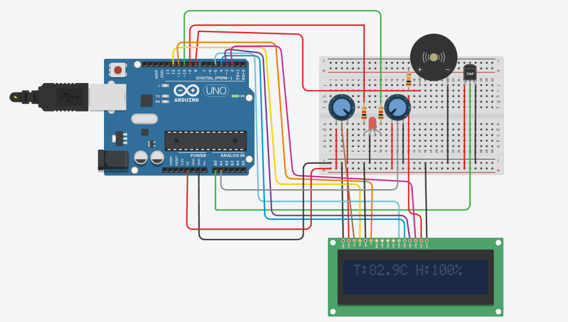

# Smart-Room-Monitor-Arduino-Sim

An Arduino-based smart room monitoring system that simulates **temperature** and **humidity** tracking using a TMP36 sensor and a potentiometer. The system gives visual feedback on an LCD and RGB LED, and auditory alerts using a buzzer.

Designed and tested using **Tinkercad Circuits**.

---

## 📷 Circuit Diagram

---

## 🎯 Features

- 🌡️ **Real-time Temperature Display** from TMP36 sensor
- 💧 **Simulated Humidity Reading** via potentiometer
- 🔊 **Buzzer Alert** when temperature exceeds a threshold
- 🌈 **RGB LED Indicators**

---

## 🧰 Components Used

| Component        | Purpose                             |
|------------------|--------------------------------------|
| Arduino Uno       | Main controller                     |
| TMP36             | Temperature sensor (analog input)   |
| Potentiometer ×2  | LCD contrast + Simulated humidity   |
| 16x2 LCD          | Displays temperature and humidity    |
| RGB LED + Resistors | Visual indicator                  |
| Buzzer            | Audio alert                         |
| Breadboard + wires| Circuit prototyping                 |

---

## ⚙️ System Logic

- TMP36 connected to **A0** gives analog temperature readings.
- Second potentiometer connected to **A1** simulates humidity.
- Buzzer turns on when `Temp > 30°C`.
- RGB LED lights based on the current temperature.
- LCD displays current temperature and humidity.

---

## 🧪 Tinkercad Simulation
🔗 [Click here to view the live circuit simulation on Tinkercad](https://www.tinkercad.com/things/bJcLPo1IO1a-fabulous-inari/editel?returnTo=https%3A%2F%2Fwww.tinkercad.com%2Fdashboard&sharecode=2lRTIaOQaqR9wuvVD48andVSEt7HRiasjXAyDMO7CmA)

(Make sure you have a Tinkercad account and are logged in to view the simulation.)

## 📽️ Demo Video
🎥 [Watch a short demo of the project](https://drive.google.com/file/d/1fqMFAbo3S4DL9zoiJYnqRRbkqds-kYUo/view?usp=sharing)

## 📁 Folder Structure

Smart-Room-Monitor-Arduino-Sim/
├── temp_humidity.ino
├── tinkercad_wiring.png
├── README.md

## ✅ To Do (Future Enhancements)
Integrate a real DHT11 sensor (outside Tinkercad)

Add IoT connectivity (e.g., ESP8266 or ESP32)

Create a mobile interface for remote monitoring

## 🤝 Contributing
Feel free to fork this project and add enhancements like real sensors, web dashboards, or Wi-Fi integration. Pull requests are welcome!

## 📜 License
This project is open-source and available under the MIT License.

